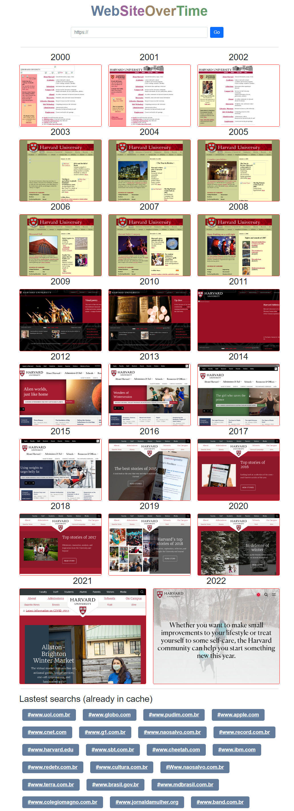

# Website Over Time

#### Video Demo:  https://www.youtube.com/watch?v=FYucijjcUzA&ab_channel=LucianoCamilo

#### Description:
  
**WebSiteOverTime** is a simple, however, a long time wish and interesting project I had ever had. As someone that have lived the dawn and the gold ages of websites and being a historical curious and pretending to have an eidetic memory, I usually am mesmerized by the transition and evolution of some websites over time.
The idea is really simples. Starting with some URL (e.g.: www.harvard.edu) and using the must needed digital library of the internet, a.k.a. internet archive (https://archive.org/), and some simple math that spreads requests over a one-year period, my project crawl the page on the site.
Using a $5 computer at Amazon LightSail – I am scrooge as Carl Bark’s Scrooge McDuck – I built three python apps: 
-	A front-end flaks site, reversed proxied using nginx, serving the screenshots previously crawled as also a search box to POST new requests via a message in AWS SQS.
-	Two simple back-end scripts orchestrated over a queue in AWS SQS. The first one, named sqs_geturl.py, read the queue and create 22 new messages in a new topic that my other script, sqs_getscreenshots.py, read and using selenium and chromedriver open the website and save the screenshot in a convenient directory I have chosen (./screenshots/domain)
  
The figure shows how the site is rendered. And I hope you have as much fun as I have playing with this project.
  

## Description of each progrman 
### Flask Front-end 

#### app.py

### Backend programns
#### sqs_getscreenshot.py

#### sqs_geturl.py
